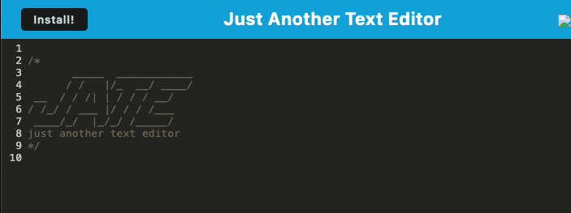

# Progressive Web Application (PWA) Challenge

In this challenge, I built a text editor that runs in the browser. This app will feature some data persistence techniques that helps incase one of the options is not supported by the browser, which means this app functions offline. I started with a bit of starter code, so I filled in the remaining files that needed completion.

## Installation
Run the following commands in your terminal to install and run this application:
<br>
```npm install```
<br>
```npm run build```
<br>
```npm run start```
<br>
These commands will install the necessary node modules needed for this application to run. The application should be live once a message pops up telling you what server it is running on. Type in "locahost:3000" to your search bar on Chrome and the application should appear.


